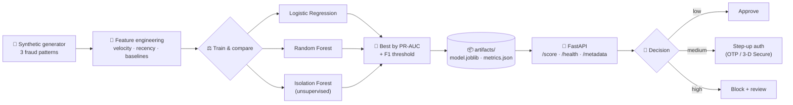

<div align="center">

# 🛡️ FinSentinel

### An open-source fraud detection starter kit — from synthetic data to a scoring API in three commands.

**One of the [Industry AI Kits](https://github.com/orgs/Kaamchor-Solutions/repositories) by [Kaamchor Solutions](https://github.com/Kaamchor-Solutions)** · Finance domain


[What's inside](#-what-has-been-built) · [Architecture](#%EF%B8%8F-architecture) · [Quickstart](#-quickstart) · [Results](#-results) · [What you can build with it](#-what-you-can-build-with-this) · [Roadmap](#-roadmap--future-scope)

</div>

---

## 💡 Why this exists

Fraud detection is the single most requested AI project in financial services — and the hardest one to *start*, because real transaction data is confidential, imbalanced, and full of leakage traps. **FinSentinel removes the starting problem.** It is a complete, runnable, honest reference implementation:

- ✅ **Zero real data required.** A synthetic transaction generator simulates thousands of customers and injects three well-known fraud patterns (card testing, big-ticket abuse, night-owl spend), so you can fork it, run it, and demo it publicly.
- ✅ **Production-shaped, not notebook-shaped.** A real package structure, a time-based train/test split, 17 tests, CI on four Python versions, and a FastAPI service that turns a model into an API.
- ✅ **Point-in-time correct features.** Every per-customer baseline (mean spend, velocity, recency) is computed from *earlier* transactions only — the #1 mistake in fraud pipelines, avoided by construction.

> ⚠️ **Honesty note:** metrics below are measured on synthetic data where fraud patterns are learnable by design — expect lower numbers on real data. What transfers to real projects is the *pipeline discipline*: leak-free features, time-based evaluation, unsupervised vs supervised comparison, and an API contract.

## 🧠 What has been built

| Component | Description |
|---|---|
| `fin_sentinel/data_generator.py` | Deterministic synthetic transaction generator (customers, categories, merchants) with three injectable fraud patterns: **card testing** (micro-transaction bursts), **big-ticket** (8–25× normal spend), **night-owl** (1–5 AM activity) |
| `fin_sentinel/features.py` | Point-in-time feature engineering: user spend baseline, amount-vs-baseline ratio, 1h/24h velocity, recency, cyclic hour encoding, night/weekend flags, static category risk |
| `fin_sentinel/train.py` | Trains and compares **Logistic Regression**, **Random Forest** and **Isolation Forest** (unsupervised), selects the best by PR-AUC on a time-based holdout, and persists a self-describing model bundle + `metrics.json` |
| `fin_sentinel/serve.py` | FastAPI scoring service: clients send *raw* transaction context, the service recomputes features and returns a fraud probability, risk band and recommended action |
| `tests/` + CI | 17 pytest cases across data, features, training and API; GitHub Actions matrix on Python 3.10 → 3.13 |

**Measured results** (49,561 synthetic transactions · 2.01% fraud · trained on the first 80% of the timeline, tested on the last 20% — full report in [`artifacts/metrics.json`](artifacts/metrics.json) after a run):

| Model | PR-AUC | ROC-AUC | Precision | Recall |
|---|---|---|---|---|
| Logistic Regression | 0.959 | 0.9987 | 0.885 | 0.890 |
| **Random Forest** ⭐ | **0.996** | **0.9999** | **0.973** | **0.958** |
| Isolation Forest *(no labels used)* | 0.917 | 0.9952 | 0.870 | 0.806 |

Most predictive features (permutation importance): `amount_vs_user_mean`, `hour_cos`, `category_risk`, `is_night` — exactly the signals a human fraud analyst would look for.

## ⚙️ Architecture



The train/test split is **temporal**: the model learns from the past and is judged on the future, mirroring how a fraud system actually performs in production.

## 🚀 Quickstart

Requires Python 3.10+.

```bash
git clone https://github.com/Kaamchor-Solutions/fin-sentinel.git
cd fin-sentinel

python -m venv .venv
source .venv/bin/activate            # Windows: .venv\Scripts\activate

pip install -r requirements.txt -r requirements-dev.txt

python -m fin_sentinel.train         # generate → features → train → evaluate (~1 min)
uvicorn fin_sentinel.serve:app --reload
```

Score a suspicious transaction (3 AM electronics purchase, 6 transactions in the last hour, 60× the customer's usual spend):

```bash
curl -X POST http://localhost:8000/score -H "Content-Type: application/json" -d '{
  "amount": 2499.0, "category": "electronics", "hour": 3, "day_of_week": 6,
  "user_mean_prior": 42.0, "minutes_since_prior_txn": 2.0,
  "txn_count_1h": 6, "txn_count_24h": 9 }'
```

Real response from this repo's model:

```json
{
  "fraud_probability": 0.979,
  "risk_band": "high",
  "recommended_action": "block and route to manual review",
  "model": "random_forest",
  "threshold": 0.5844
}
```

… versus a boring Tuesday grocery run → `{"fraud_probability": 0.0, "risk_band": "low", "recommended_action": "approve", …}` 🥱

Interactive API docs are generated automatically at **http://localhost:8000/docs**.

<details>
<summary><b>More ways to run it</b></summary>

```bash
# Explore the dataset on its own
python -m fin_sentinel.data_generator --customers 1000 --days 90 --out data/transactions.csv

# Tiny smoke run (seconds, useful for experimentation)
python -m fin_sentinel.train --quick

# Run the test suite
pytest -q

# Ship the API in a container (mount the artifacts you trained locally)
docker build -t fin-sentinel .
docker run -p 8000:8000 -v "$(pwd)/artifacts:/app/artifacts" fin-sentinel
```

</details>

## 📁 Project structure

```
fin-sentinel/
├── fin_sentinel/
│   ├── config.py           # domain vocabulary, feature list, risk bands
│   ├── data_generator.py   # synthetic transactions + fraud patterns
│   ├── features.py         # point-in-time feature engineering
│   ├── train.py            # train → compare → select → persist
│   └── serve.py            # FastAPI scoring service
├── tests/                  # 17 tests: data, features, training, API
├── artifacts/              # generated: model.joblib + metrics.json (gitignored)
├── data/                   # generated: transactions.csv (gitignored)
├── Dockerfile
└── .github/workflows/ci.yml
```

## 🔧 Configuration reference

| Knob | Where | Default | Meaning |
|---|---|---|---|
| `--customers`, `--days`, `--fraud-rate` | `train.py`, `data_generator.py` | 500 / 60 / 0.02 | Dataset shape and fraud prevalence |
| `RISK_BANDS` | `config.py` | 0.20 / 0.60 | Probability → low/medium/high banding |
| `RECOMMENDATIONS` | `config.py` | approve / step-up / block | Action per band — wire to your case management |
| `CATEGORY_RISK` | `config.py` | analyst-supplied 0–1 | Static domain risk per merchant category |
| `FIN_SENTINEL_MODEL` | env var | `artifacts/model.joblib` | Model location for the API |
| `--seed` | both | 42 | Everything is deterministic for a fixed seed |

## 🧭 What YOU can build with this

**If you're a fintech / payments engineer**
- Point `data_generator.py`'s schema at your own labeled transactions (keep the columns, swap the source) and you have a production-shaped baseline in an afternoon.
- Put `/score` behind your card-authorization flow; back `txn_count_1h/24h` with a Redis or Kafka-stream counter instead of request fields.
- Use the Isolation Forest path as your cold-start strategy for **new merchants/cards with no fraud labels yet**.

**If you're a student or educator**
- It's a complete imbalanced-learning case study: PR-AUC vs ROC-AUC, precision/recall trade-offs at a chosen threshold, and why accuracy is meaningless at 2% fraud.
- Break it on purpose: shuffle the time split and watch leakage inflate your metrics — then explain why.

**If you're a researcher / ML engineer**
- Swap the candidates for XGBoost, LightGBM or an autoencoder — the harness compares and reports automatically.
- Extend the generator with new fraud typologies (geo-velocity, device farming, account takeover) and benchmark detectors against them.

**If you're an agency or consultant**
- Use it as the 30-minute demo that wins the fraud-detection discovery call: run Quickstart live, show `/docs`, talk roadmap.

## 🗺️ Roadmap / Future scope

- [ ] **v0.2 — Explainability**: SHAP values per score + analyst-friendly reason codes ("burst of micro-txns at 3 AM")
- [ ] **v0.2 — Threshold lab**: cost-sensitive threshold optimizer (FN cost vs review cost)
- [ ] **v0.3 — Real-data connector**: loaders for public benchmarks (e.g. IEEE-CIS Fraud Detection) behind the same feature contract
- [ ] **v0.3 — Booster models**: XGBoost / LightGBM candidates in the comparison harness
- [ ] **v0.3 — Drift monitoring**: PSI/feature-drift report computed from `metrics.json` history
- [ ] **v0.4 — Streaming simulator**: Kafka + Redis feature-store docker-compose for true real-time scoring
- [ ] **v0.4 — Analyst UI**: Streamlit dashboard over flagged transactions and metrics
- [ ] **v1.0 — Model registry & A/B harness**: champion/challenger serving with shadow scoring

Have an idea? [Open an issue](https://github.com/Kaamchor-Solutions/fin-sentinel/issues) — the roadmap is meant to be pulled by users.

## 🤝 Contributing

PRs are welcome. The bar: `pytest -q` stays green, new behaviour ships with a test, and the README stays honest (no metric without a reproducible command behind it). Good first issues: roadmap items marked v0.2.

## 📜 License

[MIT](LICENSE) — use it commercially, fork it, teach with it.

---

<div align="center">

**FinSentinel** is part of the **Industry AI Kits** — a series of open, production-shaped starter projects by [Kaamchor Solutions](https://github.com/Kaamchor-Solutions), one per industry:

🛡️ [fin-sentinel](https://github.com/Kaamchor-Solutions/fin-sentinel) (finance) · 🩺 [patient-noshow-predictor](https://github.com/Kaamchor-Solutions/patient-noshow-predictor) (healthcare) · 🛒 retail · 🚚 logistics · 🏗️ construction · 🏭 manufacturing · ⚡ energy · 🌾 agriculture · 🎓 education · 🧑‍💼 HR · 📋 insurance · 🏠 real estate — *more shipping soon*

*We build AI for real industries. If your organisation needs this kit adapted to your data, [talk to us](https://github.com/Kaamchor-Solutions).*

</div>
